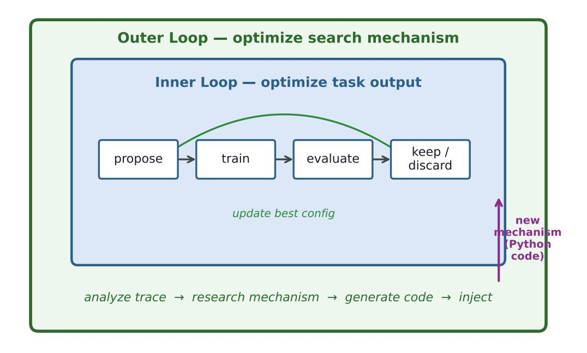
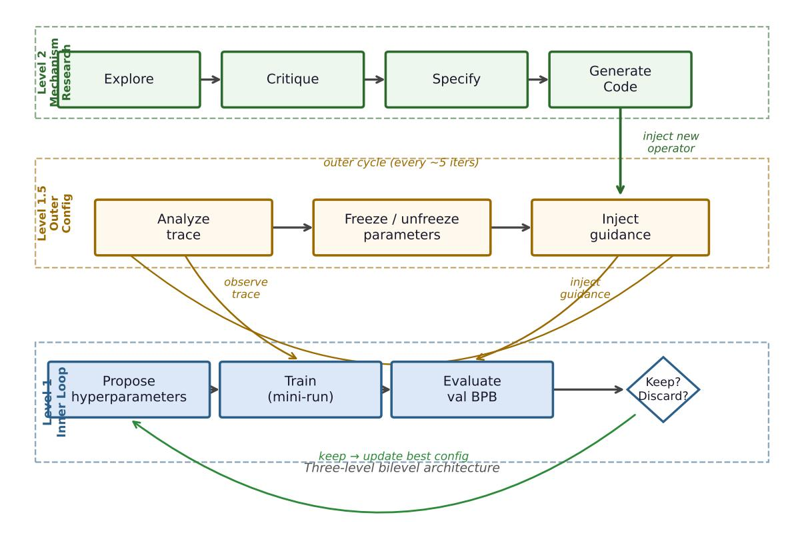
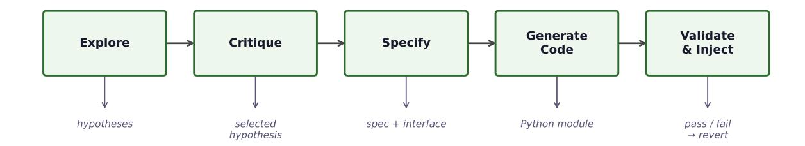
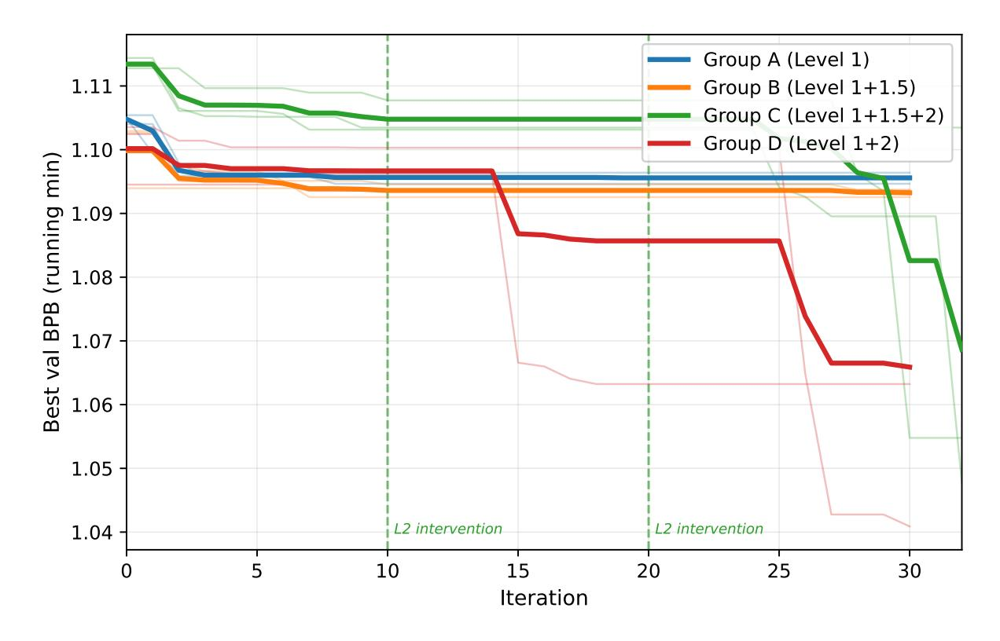

---
tags:
  - library
title: "Bilevel Autoresearch: Meta-Autoresearching Itself"
url: ""
company: [personal]
topics: []
created: 2026-04-21
source_type: pdf
source_pdf: "Bilevel Autoresearch - Meta-Autoresearching Itself.pdf"
devonthink_url: ""
hydrated: true
hydrated_at: 2026-04-21
hydrated_via: "marker+llm-ollama-gemma4:31b-cloud (LLM-failed; Ollama Cloud 502s — marker fell back to non-LLM table/header processing)"
---

## Raw Content

# Bilevel Autoresearch: Meta-Autoresearching Itself

Yaonan Qu<sup>∗</sup> Meng Lu†

#### **Abstract**

If autoresearch is itself a form of research, then autoresearch can be applied to research *itself*. We take this idea literally: we use an autoresearch loop to optimize the autoresearch loop.

Every existing autoresearch system—from Karpathy's single-track loop to AutoResearch-Claw's multi-batch extension and EvoScientist's persistent memory—was improved by a *human* who read the code, identified a bottleneck, and wrote new code. We ask whether an LLM can do the same, autonomously.

We present **Bilevel Autoresearch**, a bilevel framework where an outer loop metaoptimizes the inner autoresearch loop by generating and injecting new search mechanisms as Python code at runtime. The inner loop optimizes the task; the outer loop optimizes how the inner loop searches. Both loops use the same LLM—no stronger model is needed at the meta level.

On Karpathy's GPT pretraining benchmark, the meta-autoresearch outer loop achieves a 5× improvement over the standard inner loop alone (−0*.*045 vs. −0*.*009 val\_bpb), while parameter-level adjustment without mechanism change yields no reliable gain. The outer loop autonomously discovers mechanisms from combinatorial optimization, multi-armed bandits, and design of experiments—without human specification of which domains to explore. These mechanisms succeed by breaking the inner loop's deterministic search patterns, forcing exploration of directions the LLM's priors systematically avoid.

The core principle is simple: if autoresearch can meta-autoresearch itself, it can, in principle, *meta-autoresearch anything with a measurable objective.*

## **1 Introduction**

Large language models have demonstrated a striking capacity for self-directed scientific iteration: given a task, an LLM can propose a change, execute an experiment, observe the outcome, and decide whether to keep or discard the change. When repeated, this propose–execute–evaluate loop constitutes a form of automated research [\(Karpathy,](#page-11-0) [2026\)](#page-11-0). Instantiated for neural network hyperparameter search, we call this loop *autoresearch*.

Despite its promise, autoresearch as currently practiced has a fundamental limitation: the search *mechanism* is fixed at design time. Every system in the literature uses a human-engineered architecture. [Karpathy](#page-11-0) [\(2026\)](#page-11-0) introduced the single-track inner loop with a keep/discard acceptance rule. AutoResearchClaw [\(AIMing Lab,](#page-11-1) [2026\)](#page-11-1) extended it with multi-batch parallel search. EvoScientist [\(EvoScientist Contributors,](#page-11-2) [2026\)](#page-11-2) added persistent experience memory across runs. A human designed each improvement by reading the prior system's code, identifying a bottleneck, and writing new code to address it. The systems themselves cannot perform this operation.

This raises a natural question: *can an outer loop perform that same design step—reading code, identifying bottlenecks, writing new code—autonomously?*

We answer this question affirmatively (fig. [1\)](#page-1-0). We present **Bilevel Autoresearch**, a bilevel framework with two nested loops: the *inner loop* optimizes the task (proposing hyperparameter

<sup>∗</sup> Independent Researcher, EdwardOptimization@gmail.com

Independent Researcher, menglu\_16@connect.hku.hk

changes, training, evaluating, keeping or discarding); the *outer loop* optimizes how the inner loop searches, by reading its code, identifying bottlenecks, generating new Python mechanisms, and injecting them at runtime. Both loops use the same LLM—any improvement comes from the bilevel *architecture*, not from a more capable model.

<span id="page-1-0"></span>

Figure 1: Bilevel autoresearch: the inner loop optimizes the task output; the outer loop optimizes the inner loop's search mechanism by generating and injecting new Python code at runtime.

We evaluate the framework on Karpathy's GPT pretraining benchmark with a controlled four-group ablation (section [3\)](#page-3-0).

### **Contributions.**

- 1. We formalize autoresearch as a bilevel optimization problem and implement the outer level via a 4-round LLM dialogue that generates and injects new search mechanisms as Python code at runtime.
- 2. A controlled four-group ablation shows that mechanism research (Level 2) produces a 5× improvement over the inner loop alone (−0*.*045 ± 0*.*030 vs. −0*.*009 ± 0*.*002), while parameter-level adjustment (Level 1.5) yields no reliable gain.
- 3. We identify why: the generated mechanisms (Tabu Search, Bandit, Orthogonal Exploration) force exploration of directions the LLM's default search path systematically avoids.

## **2 Related Work**

#### **2.1 Autoresearch and LLM-Driven Optimization**

[Karpathy](#page-11-0) [\(2026\)](#page-11-0) introduced the paradigmatic autoresearch loop for neural network hyperparameter search: an LLM reads a training script, proposes a configuration change, executes training for a fixed budget, measures validation loss, and accepts or rejects the change. Iterated, this constitutes a form of LLM-guided hill climbing in configuration space, where the LLM's world knowledge serves as an implicit prior over promising changes and training outcomes provide gradient-free feedback.

AutoResearchClaw [\(AIMing Lab,](#page-11-1) [2026\)](#page-11-1) extends this framework with multi-batch parallelism: several candidate configurations are evaluated simultaneously, and the best is promoted. This increases the effective branching factor of search without altering the underlying acceptance mechanism.

EvoScientist [\(EvoScientist Contributors,](#page-11-2) [2026\)](#page-11-2) introduces persistent experience memory: lessons from prior runs are summarized and injected into future proposals, enabling cross-run learning. Both of these enhancements were designed by human researchers who inspected the prior system's code and identified architectural gaps. In all three systems, the structural decisions—when to accept, how to propose, what state to maintain—are made by human designers, not by the system itself.

#### **2.2 Bilevel Optimization**

Bilevel optimization [\(Colson et al.,](#page-11-3) [2007;](#page-11-3) [Sinha et al.,](#page-12-0) [2018\)](#page-12-0) studies problems of the form min*<sup>ϕ</sup> F*(*ϕ, θ*<sup>∗</sup> (*ϕ*)) subject to *θ* ∗ (*ϕ*) ∈ arg min*<sup>θ</sup> f*(*θ, ϕ*), where an upper-level objective *F* depends on the optimal solution of a lower-level problem parameterized by *ϕ*. Applications include meta-learning [\(Franceschi et al.,](#page-11-4) [2018\)](#page-11-4), neural architecture search [\(Liu et al.,](#page-12-1) [2019\)](#page-12-1), and hyperparameter optimization [\(Feurer and Hutter,](#page-11-5) [2019\)](#page-11-5). In our setting the upper level optimizes the search *mechanism ϕ* (the runner code) and the lower level optimizes the task performance *θ* (the training configuration). The key departure from classical bilevel optimization is that *ϕ* is a program—a discrete artifact produced by code generation—rather than a real-valued parameter vector.

### **2.3 LLM-Based Code Generation for Research**

AlphaCode [\(Li et al.,](#page-12-2) [2022\)](#page-12-2) and Codex [\(Chen et al.,](#page-11-6) [2021\)](#page-11-6) demonstrated that LLMs can write functionally correct programs from natural language specifications. FunSearch [\(Romera-Paredes](#page-12-3) [et al.,](#page-12-3) [2024\)](#page-12-3) extended this to scientific discovery, using an LLM to iteratively generate and evaluate mathematical programs, finding new results in combinatorics. Most directly related is the line of work on LLM-driven algorithm design [\(Liu et al.,](#page-12-4) [2024;](#page-12-4) [Lehman et al.,](#page-12-5) [2023\)](#page-12-5), in which LLMs propose novel algorithmic variants that are then evaluated on benchmark tasks. Our Level 2 agent applies the same code generation capacity to a different target: rather than generating task-level programs, it generates *search mechanism code* that is injected into the inner loop at runtime.

#### **2.4 Meta-Learning and Algorithm Configuration**

Meta-learning [\(Hospedales et al.,](#page-11-7) [2021\)](#page-11-7) trains models to learn efficiently from few examples by optimizing across a distribution of tasks. Algorithm configuration [\(Hutter et al.,](#page-11-8) [2011\)](#page-11-8) and algorithm selection [\(Rice,](#page-12-6) [1976\)](#page-12-6) choose among candidate algorithms or parameter settings for a given problem instance. Portfolio methods [\(Xu et al.,](#page-12-7) [2008\)](#page-12-7) maintain a library of algorithms and select among them. Bilevel Autoresearch operates in a similar spirit—the outer loop selects or generates a search mechanism—but uses LLM code generation rather than gradient-based meta-optimization or a fixed portfolio.

#### **2.5 Position of This Work**

The key distinction between Bilevel Autoresearch and all prior work is the *target* of the outer loop. Level 1.5 is closest to existing outer loops (curriculum schedulers, adaptive configuration) in that it adjusts parameters of the existing mechanism. Level 2 is categorically different: it generates code that *replaces* the mechanism entirely. To our knowledge, Bilevel Autoresearch is the first system in which an autonomous outer loop writes and injects code that modifies the

structural logic of the inner autoresearch loop at runtime, using the same model that runs the inner loop.

#### <span id="page-3-0"></span>3 Methods

#### 3.1 Framework Overview

Bilevel Autoresearch has three nested levels (fig. 2): Level 1 optimizes the task; Level 1.5 adjusts search parameters; Level 2 generates new search *mechanisms* as Python code. All levels use the same DeepSeek deepseek-chat model.

<span id="page-3-1"></span>

Figure 2: Bilevel Autoresearch architecture. Level 1 (blue) runs the standard propose—train—evaluate loop. Level 1.5 (amber) adjusts search parameters every 5 iterations. Level 2 (green) generates new Python mechanisms via a 4-round research session and injects them at runtime.

#### 3.2 Level 1: Inner Autoresearch Loop

The inner loop implements the standard autoresearch cycle (Karpathy, 2026). At each iteration t:

- 1. The LLM receives the current train.py (frozen at the best accepted configuration), the list of active editable parameters, any frozen parameters, and a strategic guidance string injected by Level 1.5.
- 2. The LLM proposes a change: a set of parameter name—value pairs and a one-sentence hypothesis.

- 3. The change is applied to a working copy of train.py and training runs for a fixed 300-second budget.
- 4. If the resulting val\_bpb is lower than the current best, the change is *kept* (the best copy is updated); otherwise it is *discarded*.

The iteration budget is fixed at 30 per repeat. The initial configuration locks DEPTH=8 and ASPECT\_RATIO=64 to prevent architecture-size changes; all other parameters (LR, WEIGHT\_DECAY, WINDOW\_PATTERN, HEAD\_DIM, TOTAL\_BATCH\_SIZE, etc.) are editable.

### **3.3 Level 1.5: Outer Search-Strategy Loop**

Level 1.5 executes every 5 inner iterations. It receives the full trace of proposals and outcomes and produces a SearchConfig update:

- **Freeze** parameters that have been proposed ≥ *k* times with zero net improvement (default *k* = 3).
- **Unfreeze** parameters that were frozen but have not been explored since the search moved to a new region.
- **Inject** a guidance string instructing the inner loop to prioritize under-explored parameters.

Level 1.5 can redirect search diversity but cannot change the proposal generation logic, the acceptance criterion, or the loop structure. These structural changes require Level 2.

#### **3.4 Level 2: Mechanism Research and Code Injection**

Level 2 executes every 2 outer cycles. It conducts a 4-round structured dialogue, each round making a single LLM call:

- 1. **Explore.** The LLM reads the full runner.py source and the search trace. It surveys mechanisms from adjacent fields (combinatorial optimization, online learning, design of experiments, Bayesian optimization) and proposes candidate improvements.
- 2. **Critique.** The LLM evaluates the candidate mechanisms against the observed failure mode (e.g., repetitive proposals, parameter fixation) and selects the most promising one.
- 3. **Specify.** The LLM writes a precise interface specification: class name, constructor arguments, key methods with signatures, and integration points in runner.py.
- 4. **Generate.** The LLM writes complete, runnable Python code implementing the specified mechanism, including any modifications to runner.py required to call it.

The generated code patches runner.py in place and is validated via importlib dynamic loading before activation. If the import succeeds, the patched runner replaces the active one; if it fails, the original is restored from a pre-patch backup. This validate-and-revert mechanism ensures that Level 2 failures are non-destructive.

#### **3.5 Algorithm**



Figure 3: Level 2 research session. Each session makes four LLM calls, producing a validated Python module that modifies the inner loop's search behavior.

### **3.6 Experimental Design**

Four groups isolate the contribution of each level (table [1\)](#page-5-0). All variables are held constant across groups: LLM model, GPU hardware (RTX 5090 32 GB, three independent servers), 300-second training budget, 30-iteration search budget, and baseline train.py. Each group runs 3 independent repeats; train.py is restored to the original baseline between repeats (verified by log inspection). The primary metric is ∆ = best − baseline val\_bpb (more negative indicates greater improvement).

<span id="page-5-0"></span>Table 1: Experimental groups. All variables (LLM, GPU, budget, baseline) are held constant across groups.

| Group | Levels Active     | Description                                                |
|-------|-------------------|------------------------------------------------------------|
| A     | Level 1 only      | Pure autoresearch, no outer intervention                   |
| B     | Level 1 + 1.5     | Inner loop plus outer strategy adjustment                  |
| C     | Level 1 + 1.5 + 2 | Full bilevel with mechanism research                       |
| D     | Level 1 + 2       | Inner loop plus mechanism research, no strategy adjustment |

## **4 Results**

#### **4.1 Primary Ablation Results**

Table [2](#page-6-0) reports val\_bpb improvement for each group across three independent repeats.

Group A achieves consistent but small improvements: −0*.*009±0*.*002. Group B is comparable to Group A (−0*.*006±0*.*006); its R1 found essentially no improvement (−0*.*000), inflating variance. Group C achieves −0*.*045 ± 0*.*030, a 5× improvement over Group A. Two of three Group C repeats (R1 and R3) show dramatic gains (−0*.*065 and −0*.*058); R2 underperformed at −0*.*011. Group D achieves −0*.*034 ±0*.*031: R2 reached the best single result across all D repeats (−0*.*063) while R1 barely improved (−0*.*001), giving a mean comparable to, but slightly below, Group C. This confirms that Level 2 is the primary driver of improvement and that Level 1.5 is not essential when Level 2 is present. fig. [4](#page-6-1) shows the search trajectories across all twelve runs.

<span id="page-6-0"></span>Table 2: val\_bpb change (∆ = best − baseline, more negative is better) over 30 inner iterations. Baseline val\_bpb varies slightly across repeats due to training randomness (range 1.094–1.114). Group C's mean improvement is 5× that of Group A and 7.5× that of Group B (by absolute |∆|). Bold values indicate the best repeat within Groups C and D.

| Group                 | R1     | R2     | R3     | ±<br>Mean<br>Std     |
|-----------------------|--------|--------|--------|----------------------|
| A (Level 1)           | −0.009 | −0.008 | −0.011 | −0.009<br>±<br>0.002 |
| B (Level 1 + 1.5)     | −0.000 | −0.010 | −0.009 | −0.006<br>±<br>0.006 |
| C (Level 1 + 1.5 + 2) | −0.065 | −0.011 | −0.058 | −0.045<br>±<br>0.030 |
| D (Level 1 + 2)       | −0.001 | −0.063 | −0.039 | −0.034<br>±<br>0.031 |

<span id="page-6-1"></span>

Figure 4: Running-minimum val\_bpb vs. iteration for all 12 runs (4 groups × 3 repeats). Thin lines: individual repeats; thick lines: group means. Groups C and D show sharp drops after Level 2 mechanisms guide the search toward TOTAL\_BATCH\_SIZE reduction.

#### **Algorithm 1** Bilevel Autoresearch (Group C configuration)

```
Input: baseline train.py, runner ϕ0, budgets T=30, K=5 (outer period), M=2 (L2 period)
θ ← baseline config; ϕ ← ϕ0; t ← 0; outer_cycle ← 0
while t < T do
  for k = 1 to K do
    proposal ← LLMPropose(θ, ϕ, guidance)
    θ
     ′ ← θ⊕ proposal
    val ← Train(θ
                   ′
                   , budget=300s)
    if val < BestVal then
      θ ← θ
            ′
            ; BestVal ← val
    end if
    t ← t + 1
  end for
  guidance, frozen ← Level1.5(trace)
  outer_cycle ← outer_cycle +1
  if outer_cycle modM = 0 then
    ϕ
     ′ ← Level2Research(ϕ, trace)
    if ValidateImport(ϕ
                          ′
                          ) then
      ϕ ← ϕ
            ′
    else
      revert ϕ
    end if
  end if
end while
return θ
```

#### **4.2 Level 2 Mechanism Inventory**

Table [3](#page-7-0) lists all mechanisms generated by Level 2 across the six research sessions (two per repeat in Group C).

<span id="page-7-0"></span>Table 3: Level 2 mechanism inventory. All code was generated on the first attempt (zero retries). Five of six mechanisms passed import validation and were activated; one (GP Regressor) was reverted due to a missing sklearn dependency.

| Repeat | Round | Mechanism                    | Domain                | Import | Active   |
|--------|-------|------------------------------|-----------------------|--------|----------|
| R1     | 1     | Tabu Search Manager          | Combinatorial opt.    | ✓      | ✓        |
| R1     | 2     | Helper class                 | —                     | ✓      | ✓        |
| R2     | 1     | Multi-Scale Bandit Proposer  | Online learning / MAB | ✓      | ✓        |
| R2     | 2     | Helper class                 | —                     | ✓      | ✓        |
| R3     | 1     | GP Regressor                 | Bayesian optimization | ×∗     | reverted |
| R3     | 2     | Syst. Orthogonal Exploration | DOE                   | ✓      | ✓        |

<sup>∗</sup> Code valid but sklearn not installed; reverted automatically.

The two "Helper class" entries are utility classes generated alongside the primary mechanisms (e.g., data structures for tracking parameter history); they are auxiliary to the named mechanism in each round.

fig. [5](#page-8-0) shows a representative excerpt from one generated mechanism (Tabu Search Manager, Group C R1). This code was written entirely by DeepSeek during a Level 2 research session; no human edited it before injection.

The three active named mechanisms are: **Tabu Search Manager** (maintains a tabu list of

```
1 class TabuSearchManager :
2 def __init__ ( self , tenure =5 , thresholds = None ):
3 self . tabu_list = []
4 self . tenure = tenure
5 self . distance_thresholds = thresholds or {}
6
7 def is_tabu ( self , config , iteration ):
8 # Remove expired entries
9 self . tabu_list = [e for e in self . tabu_list
10 if iteration <= e[" expires_at " ]]
11 for entry in self . tabu_list :
12 for param , tabu_val in entry [" config " ]. items () :
13 if param in config :
14 try :
15 diff = abs ( float ( config [ param ])
16 - float ( tabu_val ))
17 thresh = self . distance_thresholds . get (
18 param , 0.0)
19 if diff <= thresh :
20 return True # too close , blocked
21 except ( ValueError , TypeError ) :
22 if config [ param ] == tabu_val :
23 return True
24 return False # allowed
```

Figure 5: Excerpt from a Level 2 generated mechanism (Tabu Search Manager). This code written entirely by the LLM during a research session—prevents the inner loop from revisiting recently explored parameter regions, breaking the deterministic proposal patterns observed in Group A.

recently visited parameter regions, preventing the LLM from reproposing the same changes); **Multi-Scale Bandit Proposer** (treats parameter selection as a multi-armed bandit, balancing exploration and exploitation across parameters at different scales); and **Systematic Orthogonal Exploration** (forces the LLM to explore orthogonal parameter dimensions, preventing over-focus on a single parameter). Each mechanism was drawn from a different domain; Level 2 was not told which domains to consider.

#### **4.3 Search Behavior Analysis**

The four groups exhibit qualitatively different search trajectories.

**Group A: near-deterministic repetition.** All three repeats follow nearly the same proposal sequence from the same baseline: iteration 1 attempts TOTAL\_BATCH\_SIZE increase (discard); iteration 2 reduces WEIGHT\_DECAY (keep, ∆ ≈ −0*.*008); iteration 3 sets WINDOW\_PATTERN="SSSS" (keep, ∆ ≈ −0*.*002); iterations 4–30 repeat these same two changes, accumulating up to 22 consecutive discards. The LLM, given the same state, generates nearly the same proposals every time.

**Group B: redirected but bounded.** Level 1.5 correctly identifies stalled parameters and redirects search: by cycle 2–3 the outer loop freezes WEIGHT\_DECAY and WINDOW\_PATTERN and redirects toward LR, UNEMBEDDING\_LR, MATRIX\_LR, and FINAL\_LR\_FRAC. Group B explores more parameters than Group A, but achieves similarly sized improvements because it operates within the same structural keep/discard framework.

**Group C: Level 2 mechanisms unlock new directions.** The decisive event in Group C's R1 and R3 is the discovery of TOTAL\_BATCH\_SIZE *reduction* (from 2 <sup>19</sup> to 2 <sup>17</sup> or 2 <sup>18</sup>), which produces improvements of -0.039 to -0.065—roughly  $5-8\times$  larger than any single change found by Groups A or B.

Group D: Level 2 without outer loop guidance. Group D's pattern is similar to Group C: R2 and R3 independently discover TOTAL\_BATCH\_SIZE reduction (D2 reaches  $2^{17}$ , D3 reaches  $2^{18}$ ), producing improvements of -0.063 and -0.039. However, R1 failed to benefit: its two Level 2 sessions generated mechanisms (diversity\_enforcer and fixation\_detector) that failed import validation, leaving it to run as bare Level 1 with no mechanism injection; the inner loop could not discover the batch size direction on its own. The absence of Level 1.5 means there is no focused parameter-freeze guidance to steer Level 2's attention, so mechanism quality is more variable across repeats—explaining the higher variance ( $\pm 0.031$ ) relative to Group C's repeats where Level 1.5 provides enriched trace context.

#### 4.4 The TOTAL\_BATCH\_SIZE Discovery

The most impactful finding across all experiments is that reducing TOTAL\_BATCH\_SIZE from  $2^{19}$  to  $2^{17}$ – $2^{18}$  dramatically improves val\_bpb on the RTX 5090 under a 300-second training budget. The mechanism is straightforward: a smaller batch size yields more gradient steps within the fixed time budget, and better convergence for this 50M-parameter model. The original  $2^{19}$  batch size was tuned for H100 throughput; the RTX 5090 running SDPA (Flash Attention 3 is unsupported on Blackwell compute 12.0) has different optimal batch characteristics.

Groups A and B both miss this direction for the same reason: DeepSeek's default search path attempts TOTAL\_BATCH\_SIZE increase first (an implicit "larger batch is better" bias). After the increase is discarded, Group A repeats it; Group B's outer loop freezes TOTAL\_BATCH\_SIZE after the failed increase, blocking the decrease direction entirely. Only Group C's Level 2 mechanisms—specifically, Tabu Search (which prevents revisiting failed directions) and Orthogonal Exploration (which forces dimensional diversity)—pushed the LLM to try the decrease direction.

#### 5 Discussion

#### 5.1 Hypothesis Testing

The experimental design is motivated by four hypotheses.

H1 (Group B > Group A): Not supported. Group B's mean improvement  $(-0.006 \pm 0.006)$  is numerically worse than Group A's  $(-0.009 \pm 0.002)$ , though the difference is not meaningful given n = 3. The outer loop (Level 1.5) increases search diversity—Group B explores more parameters than Group A—but this diversity does not translate into larger improvements within the 30-iteration budget. Group B's R1 achieved essentially zero improvement (-0.000), the worst outcome of any repeat in any group. The outer loop correctly froze stalled parameters but, having done so, the LLM found nothing better in the remaining search space.

**H2** (Group C > Group B): Supported. Group C's mean absolute improvement  $(-0.045 \pm 0.030)$  is  $7.5 \times$  Group B's  $(-0.006 \pm 0.006)$ . Despite high variance  $(\pm 0.030)$ , two of three repeats produced dramatic improvements (-0.065, -0.058), and the separation between Groups C and B is large relative to the within-group variance, providing meaningful evidence that Level 2 adds value beyond Level 1.5.

H3 (Level 2 discovers novel mechanisms autonomously): Supported. Across three independent repeats, Level 2 generated mechanisms from three distinct active domains (combinatorial optimization, online learning, DOE) without being told which domains to consider (a fourth domain, Bayesian optimization, was attempted but reverted due to a missing dependency). Code generation succeeded on the first attempt in all six sessions (zero retries). Five of six mechanisms passed import validation and were activated.

**H4 (Group D** ≈ **Group C: Level 1.5 is not essential when Level 2 is present): Supported with caveats.** Group D's mean (−0*.*034 ± 0*.*031) is lower than Group C's (−0*.*045 ± 0*.*030), but the difference is within the variance of both groups given *n* = 3. Level 2 alone is sufficient to produce large improvements in two of three repeats; Level 1.5 does not appear to be a necessary condition. The caveat is that D's R1 produced essentially no improvement, whereas Group C had no zero-improvement repeat, suggesting Level 1.5 may provide modest robustness by enriching the search trace that Level 2 reads.

#### **5.2 Why Group C's R2 Underperformed**

Group C's R2 achieved only −0*.*011 improvement, comparable to Groups A and B, despite receiving Level 2 mechanisms. The most likely explanation is mechanism quality: R2's Level 2 generated the Multi-Scale Bandit Proposer, which—while valid and correctly injected—may be less effective than R1's Tabu Search Manager or R3's Orthogonal Exploration at forcing exploration of the batch size dimension. A secondary factor is overhead: each Level 2 research session requires approximately 3 minutes of wall time (four LLM calls), reducing effective inner iterations. With two sessions per repeat, Group C has roughly 6 minutes less search time than Groups A and B, a minor but non-zero cost.

### **5.3 Limitations**

**Small sample size.** Three repeats per group is insufficient for rigorous statistical comparison. Group C's standard deviation (±0*.*030) is 67% of its absolute mean, indicating high variability. Reliable estimates would require *n* ≥ 10 repeats per group.

**Baseline variance.** Baseline val\_bpb varies across repeats (1.094–1.114) due to training randomness from data ordering and weight initialization. Using ∆ = best − baseline mitigates this but does not eliminate it; a lower baseline gives less headroom for improvement. Future work should use fixed random seeds or report baseline-normalized metrics.

**Single benchmark.** All results are on one task: GPT pretraining at 50M parameters with a 300-second budget on RTX 5090. Generalization to other model sizes, training budgets, or tasks is unproven.

**Dynamic load fragility.** A preliminary run was invalidated because the Level 2 dynamic loading pipeline contained a sys.modules registration bug, causing all mechanism injections to silently fall back to the original runner. We fixed the bug before conducting the three reported repeats. This episode highlights the fragility of runtime code injection: silent fallback without error is a dangerous failure mode.

**External dependency exposure.** Level 2 has no constraint preventing it from importing external libraries. One of six generated mechanisms (GP Regressor) required sklearn, which was not installed. The validate-and-revert mechanism handled this correctly, but the exposure to arbitrary dependencies remains a reliability risk.

**Prompt-induced domain bias.** The Level 2 prompt explicitly suggests candidate domains (combinatorial optimization, reinforcement learning, evolutionary algorithms, Bayesian optimization). This guidance is a double-edged sword: it prevents the agent from generating irrelevant or degenerate mechanisms, but it also constrains the search space of discoverable mechanisms to domains the prompt author anticipated. Whether Level 2 would discover equally effective—or entirely different—mechanisms under an unconstrained prompt remains untested.

#### **5.4 Future Work**

Key directions include: (1) scaling to *n* ≥ 10 repeats with fixed random seeds for statistical power; (2) evaluating on multiple benchmarks (different model sizes, tasks, budgets) to assess generalization; and (3) investigating whether Level 2's code generation quality improves with a richer interface specification or a test harness.

## **6 Conclusion**

Bilevel Autoresearch demonstrates that an LLM can autonomously improve its own autoresearch loop by generating and injecting new search mechanisms at runtime. On Karpathy's GPT benchmark, Level 2 produces a 5× val\_bpb improvement over the inner loop alone (−0*.*045 vs. −0*.*009), while parameter-level adjustment (Level 1.5) yields no reliable gain. The generated mechanisms—drawn from combinatorial optimization, online learning, and design of experiments succeed by forcing exploration of directions the LLM's default search path avoids.

Code and experiment logs are available at [https://github.com/EdwardOptimization/](https://github.com/EdwardOptimization/Bilevel-Autoresearch) [Bilevel-Autoresearch](https://github.com/EdwardOptimization/Bilevel-Autoresearch).

The core principle is validated: *autoresearch can research itself.* The outer loop need not be human-designed; the same model that runs the inner loop can generate structural improvements that previously required a human researcher to write.

## **References**

- <span id="page-11-1"></span>AIMing Lab. AutoResearchClaw: Multi-batch parallel autoresearch. [https://github.com/](https://github.com/aiming-lab/AutoResearchClaw) [aiming-lab/AutoResearchClaw](https://github.com/aiming-lab/AutoResearchClaw), 2026. GitHub repository.
- <span id="page-11-6"></span>Mark Chen, Jerry Tworek, Heewoo Jun, Qiming Yuan, Henrique Ponde de Oliveira Pinto, Jared Kaplan, Harri Edwards, Yuri Burda, Nicholas Joseph, Greg Brockman, Alex Ray, et al. Evaluating large language models trained on code. *arXiv preprint arXiv:2107.03374*, 2021.
- <span id="page-11-3"></span>Benoît Colson, Patrice Marcotte, and Gilles Savard. An overview of bilevel optimization. *Annals of Operations Research*, 153(1):235–256, 2007. doi: 10.1007/s10479-007-0176-2.
- <span id="page-11-2"></span>EvoScientist Contributors. EvoScientist: Autoresearch with persistent experience memory. <https://github.com/EvoScientist/EvoScientist>, 2026. GitHub repository.
- <span id="page-11-5"></span>Matthias Feurer and Frank Hutter. Hyperparameter optimization. In *Automated Machine Learning: Methods, Systems, Challenges*, pages 3–33. Springer, 2019.
- <span id="page-11-4"></span>Luca Franceschi, Paolo Frasconi, Saverio Salzo, Riccardo Grazzi, and Massimiliano Pontil. Bilevel programming for hyperparameter optimization and meta-learning. In *Proceedings of the 35th International Conference on Machine Learning (ICML)*, pages 1563–1572, 2018.
- <span id="page-11-7"></span>Timothy Hospedales, Antreas Antoniou, Paul Micaelli, and Amos Storkey. Meta-learning in neural networks: a survey. *IEEE Transactions on Pattern Analysis and Machine Intelligence*, 44(9):5149–5169, 2021. doi: 10.1109/TPAMI.2021.3079209.
- <span id="page-11-8"></span>Frank Hutter, Holger H. Hoos, and Kevin Leyton-Brown. Sequential model-based optimization for general algorithm configuration. In *Learning and Intelligent Optimization (LION)*, pages 507–523, 2011. doi: 10.1007/978-3-642-25566-3\_40.
- <span id="page-11-0"></span>Andrej Karpathy. autoresearch: LLM-guided hyperparameter search for GPT pretraining. <https://github.com/karpathy/autoresearch>, 2026. GitHub repository.

- <span id="page-12-5"></span>Joel Lehman, Jonathan Gordon, Shawn Jain, Kamal Ndousse, Cathy Yeh, and Kenneth O. Stanley. Evolution through large models. In *Proceedings of the Genetic and Evolutionary Computation Conference Companion (GECCO)*, 2023.
- <span id="page-12-2"></span>Yujia Li, David Choi, Junyoung Chung, Nate Kushman, Julian Schrittwieser, Rémi Leblond, Tom Eccles, James Keeling, Felix Gimeno, Agustin Dal Lago, et al. Competition-level code generation with AlphaCode. *Science*, 378(6624):1092–1097, 2022. doi: 10.1126/science. abq1158.
- <span id="page-12-4"></span>Fei Liu, Xialiang Tong, Mingxuan Yuan, Xi Lin, Fu Luo, Zhenkun Wang, Zhichao Lu, and Qingfu Zhang. Evolution of heuristics: Towards efficient automatic algorithm design using large language model. *arXiv preprint arXiv:2401.02051*, 2024.
- <span id="page-12-1"></span>Hanxiao Liu, Karen Simonyan, and Yiming Yang. DARTS: Differentiable architecture search. In *International Conference on Learning Representations (ICLR)*, 2019.
- <span id="page-12-6"></span>John R. Rice. The algorithm selection problem. *Advances in Computers*, 15:65–118, 1976. doi: 10.1016/S0065-2458(08)60520-3.
- <span id="page-12-3"></span>Bernardino Romera-Paredes, Mohammadamin Barekatain, Alexander Novikov, Matej Balog, M.Pawan Kumar, Emilien Dupont, Francisco J. ˜ R. Ruiz, Jordan S. Ellenberg, Pengming Wang, ˜ Omar Fawzi, et al. Mathematical discoveries from program search with large language models. *Nature*, 625:468–475, 2024. doi: 10.1038/s41586-023-06924-6.
- <span id="page-12-0"></span>Ankur Sinha, Pekka Malo, and Kalyanmoy Deb. A review on bilevel optimization: from classical to evolutionary approaches and applications. *IEEE Transactions on Evolutionary Computation*, 22(2):276–295, 2018. doi: 10.1109/TEVC.2017.2712906.
- <span id="page-12-7"></span>Lin Xu, Frank Hutter, Holger H. Hoos, and Kevin Leyton-Brown. SATzilla: Portfolio-based algorithm selection for SAT. *Journal of Artificial Intelligence Research*, 32:565–606, 2008.
