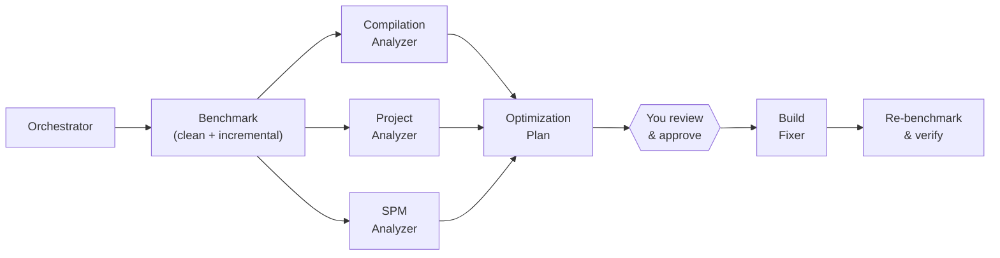

---
tags:
  - library
title: "AvdLee/Xcode-Build-Optimization-Agent-Skill: An Agent Skill helping you to optimize Xcode incremental and clean builds by running benchmarks and optimizing build settings."
url: "https://github.com/AvdLee/Xcode-Build-Optimization-Agent-Skill"
company: [personal]
topics: []
created: 2026-03-30
source_type: raindrop
raindrop_id: 1665244875
source_domain: "github.com"
source_type_raindrop: link
collection: "AI Repos & Open Source"
collection_id: 69284315
hydrated: true
hydrated_at: 2026-04-17
hydrated_via: github-api
---
## Excerpt

An Agent Skill helping you to optimize Xcode incremental and clean builds by running benchmarks and optimizing build settings. - AvdLee/Xcode-Build-Optimization-Agent-Skill

## Raw Content

<!-- Hydrated 2026-04-17 via github-api -->

<a href="https://www.rocketsim.app"></a>

# Xcode Build Optimization Agent Skills

Open-source Agent Skills for benchmarking and optimizing Xcode build performance across clean builds, incremental builds, compile hotspots, project settings, and Swift Package Manager overhead.

## Quick Start

Install all six skills (the orchestrator needs the specialist skills to work):

```bash
npx skills add https://github.com/avdlee/xcode-build-optimization-agent-skill
```

Then open your Xcode project in your AI coding tool and say:

> Use the /xcode-build-orchestrator skill to analyze build performance and come up with a plan for improvements.

The agent will benchmark your clean and incremental builds, audit build settings, find compile hotspots, and produce an optimization plan at `.build-benchmark/optimization-plan.md`. No project files are modified until you explicitly approve changes.

For long-term monitoring across days, machines, Xcode versions, and teams, use [RocketSim Build Insights](https://www.rocketsim.app/docs/features/build-insights/build-insights/) and [Team Build Insights](https://www.rocketsim.app/docs/features/build-insights/team-build-insights/).

## Every Second Counts

A 1-second improvement on a 30-second incremental build sounds small. At 50 builds a day, that adds up to **3.5 hours per developer per year** -- or **35 hours across a team of ten**.

Most projects have several seconds of easy wins hiding in build settings, script phases, and compiler flags. This skill finds them.

## How It Works

The orchestrator coordinates five specialist skills in a recommend-first workflow. Nothing is modified until you approve.



**Phase 1 -- Analyze.** The orchestrator benchmarks your project, runs the three specialist analyzers, and produces a prioritized optimization plan at `.build-benchmark/optimization-plan.md`. No project files are modified.

> Use the Xcode build orchestrator to analyze build performance and come up with a plan for improvements.

**Phase 2 -- Fix.** Review the plan, check the approval boxes for the items you want, and ask the agent to apply them. The fixer implements only approved changes and re-benchmarks to verify.

> Implement the approved items from the optimization plan at .build-benchmark/optimization-plan.md, then re-benchmark to verify the improvements.

The plan file is your evidence trail -- shareable with teammates, reviewable in PRs, and diffable over time.

## What It Checks

The agent runs [over 40 individual checks](OPTIMIZATION-CHECKS.md) across build settings, project configuration, source code, and package dependencies.

| Check | What the agent looks for | |
|-------|--------------------------|---|
| Build settings audit | Debug/Release/General settings against best practices (compilation mode, optimization level, eager linking, compilation caching) | [Details](OPTIMIZATION-CHECKS.md#build-settings-audit) |
| Script phase analysis | Missing input/output declarations, scripts running unnecessarily, debug/simulator guards | [Details](OPTIMIZATION-CHECKS.md#script-phase-analysis) |
| Compile hotspot detection | Long type-checks, complex expressions, compiler diagnostic flags | [Details](OPTIMIZATION-CHECKS.md#compile-hotspot-detection) |
| Zero-change build overhead | Fixed-cost phases (codesign, validation, scripts) inflating incremental builds | [Details](OPTIMIZATION-CHECKS.md#zero-change-build-overhead) |
| Target dependency review | Accuracy, parallelism blockers, monolithic targets | [Details](OPTIMIZATION-CHECKS.md#target-dependency-review) |
| Module variant detection | Config drift across targets causing duplicate module builds | [Details](OPTIMIZATION-CHECKS.md#module-variant-detection) |
| SPM graph analysis | Plugin overhead, branch pins, package layering, circular dependencies | [Details](OPTIMIZATION-CHECKS.md#spm-graph-analysis) |
| Swift macro impact | Cascading rebuilds, swift-syntax universal builds | [Details](OPTIMIZATION-CHECKS.md#swift-macro-impact) |
| SwiftUI view decomposition | Monolithic body properties, result builder complexity | [Details](OPTIMIZATION-CHECKS.md#swiftui-view-decomposition) |
| Asset catalog parallelism | Single-threaded compilation bottleneck, splitting for parallel builds | [Details](OPTIMIZATION-CHECKS.md#asset-catalog-parallelism) |
| Access control optimization | Missing `final`, overly broad visibility inflating compiler work | [Details](OPTIMIZATION-CHECKS.md#access-control-optimization) |
| Incremental build diagnostics | Planning Swift module, SwiftEmitModule, Task Backtraces | [Details](OPTIMIZATION-CHECKS.md#incremental-build-diagnostics) |

## Community Results

Real-world improvements reported by developers who used these skills. Add your own by opening a pull request.

The `xcode-build-orchestrator` generates your table row at the end of every optimization run, so contributing is a single copy-paste.

> [!NOTE]
> A small clean-build increase is normal when enabling compilation caching -- the first cold build populates the cache. Cached clean builds (branch switching, pulling changes) and incremental builds are where the real gains show up.

| App | Clean Build | Incremental Build |
|-----|------------|-------------------|
| [Helm for App Store Connect](https://helm-app.com) | 86s → 91s (+5s / within noise) | 70s → 9s (-61s / 87% faster) |
| [Stock Analyzer](https://www.stock-analyzer.app) | 41.5s → 33.2s (-8.3s / 20% faster) | 5.3s → 3.6s (-1.7s / 32% faster) |
| [Enchanted](https://github.com/gluonfield/enchanted/pull/216) | 19.4s → 16.6s (-2.8s / 14% faster) | 2.5s → 2.2s (-0.3s / 12% faster) |
| [Wikipedia iOS](https://github.com/wikimedia/wikipedia-ios/pull/5740) | 48.7s → 46.5s (-2.2s / 5% faster) | 12.9s → 12.2s (-0.7s / 5% faster) |
| [Kickstarter iOS](https://github.com/kickstarter/ios-oss/pull/2808) | 83.4s → 83.5s (~0s / within noise) | 10.9s → 10.6s (-0.3s / 3% faster) |
| [Dash](https://dashworkouts.app) | 67.8s → 66.9s (-0.9s / within noise) | 6.7s → 7.1s (+0.4s / within noise) |
| [Klivvr](https://klivvr.com/) | 247ss → 167s (-80s / 32% faster) | 48s → 48s (same) |

## Who This Is For

- iOS and macOS teams with slow local build loops
- developers investigating a recent build-time regression
- teams that want evidence-backed Xcode build optimization instead of guesswork
- developers who want a reusable Agent Skills package, not a one-off script

## Included Skills

| Skill | Purpose |
|-------|---------|
| `xcode-build-orchestrator` | End-to-end workflow: benchmark, analyze, prioritize, approve, fix, re-benchmark |
| `xcode-build-benchmark` | Repeatable clean and incremental build benchmarks with timestamped artifacts |
| `xcode-compilation-analyzer` | Swift compile hotspot analysis and source-level recommendations |
| `xcode-project-analyzer` | Build settings, scheme, script phase, and target dependency auditing |
| `spm-build-analysis` | Package graph, plugin overhead, and module variant review |
| `xcode-build-fixer` | Apply approved optimization changes and verify with benchmarks |

The orchestrator is the recommended starting point -- it coordinates the other five skills automatically. Install all six skills so the orchestrator can access each specialist.

## Installation Options

### Option A: Using skills.sh

Install all six skills (required -- the orchestrator depends on the specialist skills):

```bash
npx skills add https://github.com/avdlee/xcode-build-optimization-agent-skill
```

To install a single skill for standalone use, add the `--skill` flag:

```bash
npx skills add https://github.com/avdlee/xcode-build-optimization-agent-skill --skill xcode-project-analyzer
```

Available individual skills: `xcode-build-benchmark`, `xcode-compilation-analyzer`, `xcode-project-analyzer`, `spm-build-analysis`, `xcode-build-orchestrator`, `xcode-build-fixer`. Note that the orchestrator requires all other skills to be installed.

### Option B: Claude Code Plugin

1. Add the marketplace:

```bash
/plugin marketplace add AvdLee/Xcode-Build-Optimization-Agent-Skill
```

2. Install the plugin:

```bash
/plugin install xcode-build-skills@xcode-build-skills
```

To enable for everyone in a repository, add to your project configuration:

```json
{
  "enabledPlugins": {
    "xcode-build-skills@xcode-build-skills": true
  },
  "extraKnownMarketplaces": {
    "xcode-build-skills": {
      "source": {
        "source": "github",
        "repo": "AvdLee/Xcode-Build-Optimization-Agent-Skill"
      }
    }
  }
}
```

### Option C: Cursor Plugin (coming soon)

This repository is packaged for Cursor plugin submission, but the marketplace listing is not live yet.

Once approved, you'll be able to install it from the Cursor Marketplace.

### Option D: Codex / OpenAI-compatible tools

This repository includes an `agents/openai.yaml` manifest. Copy or symlink the skill folders into your Codex skills directory:

```bash
cp -R skills/ "$CODEX_HOME/skills/"
```

See [Codex skills documentation](https://developers.openai.com/codex/skills/#where-to-save-skills) for details on where to save skills.

### Option E: Using pi package manager

Install via [pi](https://github.com/mariozechner/pi-mono):
```bash
pi install https://github.com/AvdLee/Xcode-Build-Optimization-Agent-Skill
```

The skills will be available automatically in pi sessions.

### Option F: Manual Install

1. Clone this repository.
2. Install or symlink the specific skill folder from `skills/` that you want.
3. Ask your AI coding tool to use the corresponding skill.

Useful docs: [Codex Skills](https://developers.openai.com/codex/skills/#where-to-save-skills) | [Claude Code Agent Skills](https://code.claude.com/en/skills) | [Cursor Skills](https://cursor.com/docs/context/skills#enabling-skills)

## Why Clean And Incremental Builds Both Matter

Clean builds expose:

- package and module setup cost
- full project graph overhead
- target structure and explicit-module issues

Incremental builds expose:

- edit-loop pain
- run script bottlenecks
- cache invalidation problems
- repeated package-plugin overhead

That distinction is central to this repo and follows both Apple's Xcode guidance and the SwiftLee workflow in [Build performance analysis for speeding up Xcode builds](https://www.avanderlee.com/optimization/analysing-build-performance-xcode/).

## See Also My Other Skills

- [Swift Concurrency Expert](https://github.com/AvdLee/Swift-Concurrency-Agent-Skill)
- [SwiftUI Expert](https://github.com/AvdLee/SwiftUI-Agent-Skill)
- [Core Data Expert](https://github.com/AvdLee/Core-Data-Agent-Skill)
- [Swift Testing Expert](https://github.com/AvdLee/Swift-Testing-Agent-Skill)

## Shared Support Layer

Each skill bundles its own copies of the scripts, references, and schemas it needs so it works after standalone installation. The canonical copies live at the repo root:

- `scripts/` -- helper scripts for benchmarking, timing-summary parsing, compilation diagnostics, report generation, and recommendation rendering
- `references/` -- build settings best practices, artifact format, recommendation format, and source citations
- `schemas/` -- JSON schema for benchmark output

When a root-level file changes, the corresponding copies inside each skill that uses it must be updated (see [CONTRIBUTING.md](CONTRIBUTING.md)).

## Skill Structure
<!-- BEGIN SKILL STRUCTURE -->
```text
skills/
  xcode-build-benchmark/
    SKILL.md
    references/
      benchmark-artifacts.md
      benchmarking-workflow.md
  xcode-compilation-analyzer/
    SKILL.md
    references/
      build-optimization-sources.md
      code-compilation-checks.md
      recommendation-format.md
  xcode-project-analyzer/
    SKILL.md
    references/
      build-optimization-sources.md
      build-settings-best-practices.md
      project-audit-checks.md
      recommendation-format.md
  spm-build-analysis/
    SKILL.md
    references/
      build-optimization-sources.md
      recommendation-format.md
      spm-analysis-checks.md
  xcode-build-orchestrator/
    SKILL.md
    references/
      benchmark-artifacts.md
      build-settings-best-practices.md
      orchestration-report-template.md
      recommendation-format.md
  xcode-build-fixer/
    SKILL.md
    references/
      build-settings-best-practices.md
      fix-patterns.md
      recommendation-format.md
```
<!-- END SKILL STRUCTURE -->

## Research Basis

All checks are grounded in Apple documentation, WWDC sessions, and proven community practices. See [OPTIMIZATION-CHECKS.md](OPTIMIZATION-CHECKS.md) for the full list of checks with references to each source.

The stored reference summaries live in `references/build-optimization-sources.md`.

## RocketSim Positioning

This repo helps you optimize point-in-time build performance with an agent-guided workflow.

RocketSim complements it by monitoring build performance over time:

- automatic clean vs incremental build tracking
- duration trends and percentile metrics
- machine, Xcode, and macOS comparisons
- team-wide visibility without custom build scripts

If you want to catch regressions earlier and see whether your build times are improving over weeks or months, use [RocketSim Build Insights](https://www.rocketsim.app/docs/features/build-insights/build-insights/) after you apply the improvements from this repo.

## Contributing

Contributions are welcome when they keep the repo focused on Xcode build optimization and Agent Skills format quality.

Please read [CONTRIBUTING.md](CONTRIBUTING.md) for:

- skill-authoring guidance
- repo scope and quality standards
- workflow notes for scripts and README sync

## About The Author

Created by [Antoine van der Lee](https://www.avanderlee.com), creator of SwiftLee and RocketSim. The practical build workflow in this repository is informed by the SwiftLee article [Build performance analysis for speeding up Xcode builds](https://www.avanderlee.com/optimization/analysing-build-performance-xcode/) and ongoing work on RocketSim Build Insights.

## License

This repository is available under the MIT License. See [LICENSE](LICENSE) for details.
