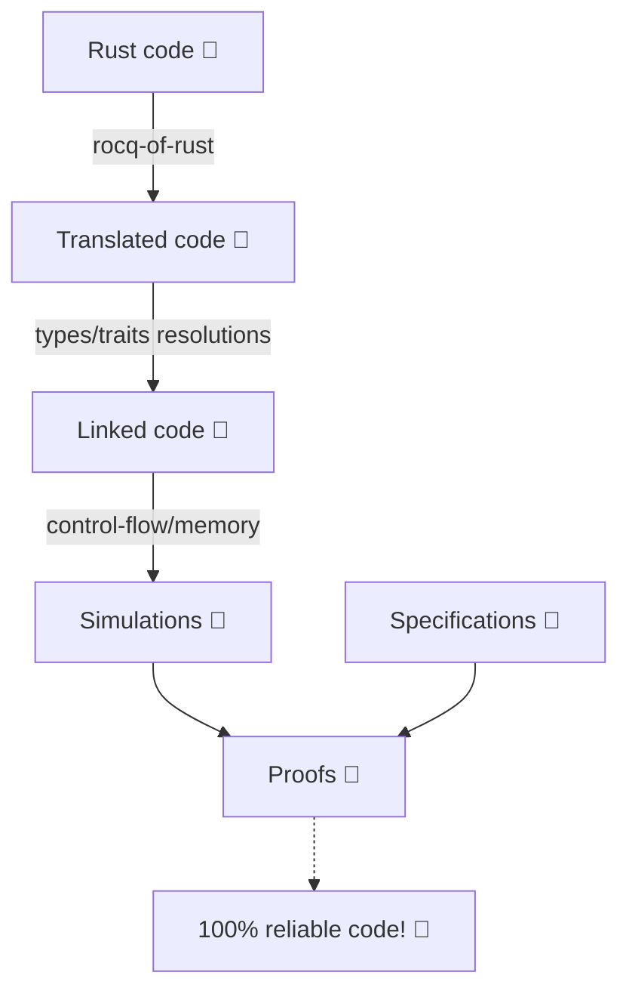

---
tags:
  - library
title: "GitHub - formal-land/coq-of-rust: Formal verification tool for Rust: check 100% of execution cases of your programs 🦀 to make super safe applications! ✈️ 🚀 ⚕️ 🏦"
url: "https://github.com/formal-land/coq-of-rust"
company: [personal]
topics: []
created: 2025-05-15
source_type: raindrop
raindrop_id: 1040899639
source_domain: "github.com"
source_type_raindrop: link
collection: "AI Repos & Open Source"
collection_id: 69284315
hydrated: true
hydrated_at: 2026-04-17
hydrated_via: github-api
---
## Excerpt

Formal verification tool for Rust: check 100% of execution cases of your programs 🦀 to make super safe applications! ✈️ 🚀 ⚕️ 🏦 - formal-land/coq-of-rust

## Raw Content

<!-- Hydrated 2026-04-17 via github-api -->

#  <span style="vertical-align: middle;">rocq-of-rust</span>

> Formal verification tool for Rust: check 100% of execution cases of your programs to ensure they are safe and correct.

Even if the type system of Rust prevents many mistakes, including memory errors, the code is still not immune to vulnerabilities, such as security vulnerabilities, unexpected panics, or wrongly implemented business rules.

One way to go further is to **mathematically** prove that the code implements its specification for all inputs: this is named "formal verification" and what `rocq-of-rust` proposes for Rust. Note that this tool is a work in progress in many parts, although it aims to provide better coverage than testing or manual reviewing. To get 100% guarantee, the best is to additionally lower the verification down to the assembly level.

| We propose formal verification as a service, including designing the specification and the proofs.<br /><br />**➡️ [Book a meeting](https://calendly.com/guillaume-claret) ⬅️** |
| --- |

_The development of `rocq-of-rust` was mainly funded by the **Ethereum Foundation** and the **Aleph Zero Foundation**. We thank them for their support!_

## Table of Contents

- [Example](#example)
- [Rationale](#rationale)
- [Prerequisites](#prerequisites)
- [Installation and User Guide](#installation-and-user-guide)
- [Features](#language-features)
- [Contact](#contact)
- [Alternative Projects](#alternative-projects)
- [License](#license)
- [Contributing](#contributing)

## Example
At the heart of `rocq-of-rust` is the translation of Rust programs to idiomatic code in the [theorem prover Rocq](https://rocq-prover.org/). Once in Rocq, the code can be verified using standard proof techniques.

The translation is in three steps:

1. Import of the THIR representation of Rust to Rocq, running `cargo rocq-of-rust`.
2. Type-checking and trait inference with native Rocq types and typeclasses (we call it linking).
3. Representation of the control-flow and memory manipulations in a purely functional style (we call it simulation).

Here is an example of a Rust function:
```rust
fn add_one(x: u32) -> u32 {
    x + 1
}
```

We can prove it equivalent to the purely functional Rocq code:
```coq
Definition add_one (x : u32) : u32 :=
  x +i 1.
```

For reference, here is the representation of the THIR in Rocq for this function:
```coq
Definition add_one (ε : list Value.t) (τ : list Ty.t) (α : list Value.t) : M :=
  match ε, τ, α with
  | [], [], [ x ] =>
    ltac:(M.monadic
      (let x := M.alloc (| Ty.path "u32", x |) in
      M.call_closure (|
        Ty.path "u32",
        BinOp.Wrap.add,
        [ M.read (| x |); Value.Integer IntegerKind.U32 1 ]
      |)))
  | _, _, _ => M.impossible "wrong number of arguments"
  end.
```

## Application

We are currently verifying [Revm](https://github.com/bluealloy/revm), a Rust implementation of the Ethereum virtual machine (EVM), to show it equivalent to a specification written in a purely functional style. This is an ongoing work in the folder [RocqOfRust/revm](RocqOfRust/revm) and funded by a grant from the [Ethereum Foundation](https://ethereum.foundation/).

## Workflow

Here is the typical workflow of usage for `rocq-of-rust`:



We start by generating an automatic translation of the Rust we verify to Rocq code with `rocq-of-rust`. The translation is originally verbose. We go through two semi-automated refinement steps, links and simulations, that gradually make the code more amenable to formal verification.

Finally, we write the **specifications** and **prove** that our Rust program fulfills them **for any possible user input**.

Examples of typical specifications are:

- The code cannot panic.
- This clever data structure is equivalent to its naive version, except for the execution time.
- This new release, which introduces new endpoints and does a lot of refactoring, is fully backward-compatible with the previous version.
- Data invariants are properly preserved.
- The storage system is sound, as what goes in goes out (this generally amounts to state that the serialization/deserialization functions are inverse).
- The implementation behaves as a special case of what the whitepaper describes once formally expressed.

## Prerequisites

- Rust
- Rocq (see [rocq-of-rust.opam](./RocqOfRust/rocq-of-rust.opam))

## Installation and User Guide

The [build tutorial](./docs/BUILD.md) provides detailed instructions on building and installing `rocq-of-rust`, while the [user tutorial](./docs/GUIDE.md) provides an introduction to the `rocq-of-rust` command line interface and the list of supported options.

## Contact
For formal verification services (training or application) on your Rust code base, contact us at [&#099;&#111;&#110;&#116;&#097;&#099;&#116;&#064;formal&#046;&#108;&#097;&#110;&#100;](mailto:contact@formal.land). Formal verification can apply to smart contracts, database engines, or any critical Rust project.

## Alternative Projects

Here are other projects working on formal verification for Rust:

- [Aeneas](https://github.com/AeneasVerif/aeneas): Translation from MIR to purely functional Rocq/F* code. Automatically put the code in a functional form. See their paper [Aeneas: Rust verification by functional translation](https://dl.acm.org/doi/abs/10.1145/3547647).
- [Hax](https://github.com/cryspen/hax): Translation from THIR to Rocq/F*/Lean code
- [Creusot](https://github.com/xldenis/creusot): Translation from MIR to Why3 (and then SMT solvers)
- [Verus](https://github.com/verus-lang/verus): Automatic verification for Rust with annotations
- [Kani](https://github.com/model-checking/kani): Model-checking with [CBMC](https://github.com/diffblue/cbmc)

## License

This project uses dual licensing:

- **Rocq proofs and libraries** (`RocqOfRust/`): [MIT License](RocqOfRust/LICENSE)
- **Rust transpiler** (`cli/`, `lib/`): [AGPL-3.0 License](lib/LICENSE)

## Contributing

This is all open-source software.

Open some pull requests or issues to contribute to this project. All contributions are welcome! See the [License](#license) section for details on the licensing terms. There is a bit of code taken from the [Creusot](https://github.com/xldenis/creusot) project to make the Cargo command `rocq-of-rust` and run the translation in the same context as Cargo.
